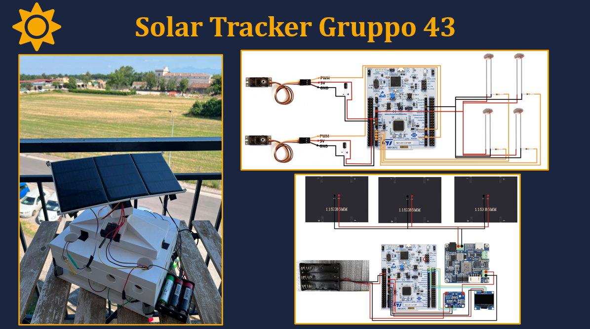

# Dual-Axis Solar Tracker (STM32 Bare-Metal)

An automated, self-sufficient dual-axis solar tracker engineered from scratch using **Bare-Metal C** on the **STM32G474RE** microcontroller. 

This repository was developed as an exam project for the **Computer Architecture and Design** course. It demonstrates low-level hardware control (memory-mapped registers), advanced interrupt handling, and autonomous power management without relying on heavy abstraction layers like HAL.

---

##  Table of Contents
1. [System Overview](#-system-overview)
2. [Bill of Materials (Components)](#-bill-of-materials-components)
3. [3D Printing Designs](#-3d-printing-designs)
4. [Software & Peripherals](#-software--peripherals)
5. [Operating Logic](#-operating-logic)
6. [Power Management & Telemetry](#-power-management--telemetry)
7. [Getting Started](#-getting-started)

---

##  System Overview
The goal of this project is to create a fully autonomous solar energy harvesting system. The tracker uses light-dependent resistors (LDRs) to detect the position of the sun and orients the solar panel using two servos (Pan and Tilt) to maximize light incidence. 

To ensure the system is completely self-sufficient:
* The panel charges a **Li-Ion battery** through an **MPPT** (Maximum Power Point Tracking) module.
* The MCU spends most of its time in a deep **Stop Mode**, waking up periodically via an internal **RTC Timer** to adjust the panel and measure energy statistics.
* An **INA219** sensor continuously monitors current and voltage, proving the energetic advantage of the tracking movement in real-time.

---

##  Bill of Materials (Components)
Below is the complete list of hardware components used to build the solar tracker:

* **Microcontroller:** STMicroelectronics NUCLEO-G474RE (ARM Cortex-M4)
* **Solar Panel:** 12V, 1.5W peak power output rigid panel
* **Light Sensors:** 4x LDRs (Light Dependent Resistors) paired with voltage divider resistors
* **Actuators:** 2x MG90S Micro Servomotors (for Pan and Tilt axes)
* **Power Sensor:** INA219 I2C DC current and voltage sensor module
* **Power Management:** MPPT (Maximum Power Point Tracking) charging module
* **Battery:** 1x 18650 Li-Ion Cell (3.7V)
* **Protection:** Battery Management System (BMS) for under/over-voltage protection
* **Display:** 0.96" OLED SSD1306 (128x64) communicating via I2C
* **Miscellaneous:** Breadboards, jumper wires, and 10k/1k resistors for the sensor dividers

---

##  3D Printing Designs
All the structural components of the solar tracker were custom-designed and 3D printed. You can find all the `.stl` and CAD project files in the dedicated 3D printing folder of this repository.

The 3D printed assembly includes:
* The main base and electronics housing.
* The Pan and Tilt articulation mechanisms designed to house the MG90S servos.
* The support frame holding the solar panel and perfectly aligning the 4 corner LDRs on the same plane.

---

##  Software & Peripherals
The entire software stack is written in pure bare-metal C (`mainPROG.c`), directly manipulating MCU registers to configure clocks, GPIOs, and interrupts.

* **ADC1 & ADC2**: Reads the analog values from the 4 LDRs (12-bit resolution, 0-4095).
* **TIM2 (PWM)**: Operates at 50Hz to generate the precise control signals for the Pan and Tilt servos.
* **I2C1**: A shared bus controlling both the INA219 power sensor and the SSD1306 OLED display. *Note: The OLED driver was custom-written from scratch to minimize memory footprint, avoiding heavy external libraries.*
* **USART2**: Asynchronous serial communication (115200 baud) for detailed PC telemetry logging.
* **RTC (Real-Time Clock)**: Triggers periodic Wakeup Timer interrupts to pull the MCU out of deep sleep.
* **EXTI / NVIC**: Manages hardware interrupts (RTC Wakeup, User Button B1).

---

##  Operating Logic

### 1. Light Tracking Algorithm
The system uses a comparative differential algorithm. The four LDRs are paired (Top vs. Bottom, Left vs. Right). 
If the difference between opposite pairs exceeds a defined `TOLERANCE`, the system adjusts the corresponding servo. To prevent mechanical strain and violent oscillations (pendulum effect), the servos move in **micro-steps** (~1° at a time) with brief stabilization pauses.

### 2. Zenith Saturation / "Sniper Mode"
When the sun is directly overhead, all LDRs saturate to their maximum values, making differences virtually indistinguishable (noise). The software detects this edge case and ceases unnecessary calculations and movements to save power and prevent fine-limit collisions.

### 3. Operating Phases
The lifecycle is divided into two programmable phases, managed by the RTC:
* **Demo Phase (First 20 Cycles):** The MCU wakes up every **2 seconds**, performs tracking, logs telemetry to the OLED/PC, and goes back to sleep. Ideal for presentations.
* **Industrial Phase:** The MCU shifts to a **15-minute** sleep interval. This creates a highly positive net energy balance, as the brief ~1-second active tracking cost is easily offset by the power generated during the long sleep window.

---

##  Power Management & Telemetry

### Mitigating Voltage Sag
A naive direct connection between the solar panel, servos, and MCU would result in system resets. When the MG90S servos spike in current demand, the bus voltage sags. The inclusion of the **MPPT module** and **BMS** isolates the logic circuit from the actuators, ensuring the STM32 remains stable even during peak mechanical load.

### Telemetry Output
Upon every wake-up cycle, the OLED and USART output the following statistics:
* **Battery State:** Voltage (mV) and estimated Charge Percentage (%).
* **Current & Power:** Real-time generation (mA and mW).
* **Sensor Values:** Raw analog values of the 4 LDRs.
* **Actuator State:** Current Pan and Tilt angles.
